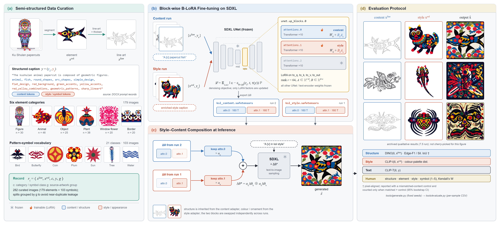

# KUSHULAN Papercut B-LoRA


[](https://github.com/lzwhehe/kushulan-papercut-blora/actions/workflows/ci.yml)
[](https://huggingface.co/stabilityai/stable-diffusion-xl-base-1.0)
[](https://github.com/yardenfren1996/B-LoRA)

本项目以库淑兰剪纸为研究对象，探索如何在保留人物、动物、植物等元素结构的同时，迁移剪纸的色彩、纹样与装饰风格。研究流程围绕 **数据整理 → SDXL / B-LoRA 风格与内容分离 → 生成与评估** 展开，将传统剪纸资料与生成式模型实验连接起来。

仓库提供 **179 张代表元素、103 张纹样符号、两轮 LoRA 实验权重与检查点，以及内容—风格—生成结果对照**，并附带提示词资料、官方训练/推理入口和逐文件校验工具，便于查看研究过程与继续实验。

[English](docs/README.en.md) · [方法流程](#方法流程) · [生成结果](#生成结果) · [快速开始](#快速开始) · [数据说明](docs/DATASET.md) · [实验记录](docs/EXPERIMENTS.md) · [完整下载](docs/MIGRATION.md)

## 方法流程

[](docs/assets/framework/framework.pdf)

*方法框架图（论文版矢量 PDF：[framework.pdf](docs/assets/framework/framework.pdf)，LaTeX 引用与中英文图注见 [说明](docs/assets/framework/README.md)）。图中只嵌入仓库已有的数据与 7.5 结果缩略图，不含未经复核的分数。*

<details><summary>原始研究流程图</summary>

[](docs/assets/research-pipeline.jpg)

*研究流程概览，点击图片可查看原图。图中数值保留所提供流程图的原始口径；与当前仓库资料的对应关系和待复核项见 [实验记录](docs/EXPERIMENTS.md#与参考图的对应关系)。*

</details>

### 1. 剪纸元素与纹样整理

从原始作品中整理代表元素与纹样符号，按人物、动物、植物、日常器物、窗花和边框组织数据。流程图进一步描述了线稿提取、轮廓加粗、人工重着色和语义标注方案；仓库保留各阶段已有图像版本、处理文档与提示词资料。

### 2. 风格与内容分离生成

以 SDXL 为基础，使用 B-LoRA 的目标注意力块分别提取内容与风格信息，在推理时组合来自不同实验的权重。线稿与内容描述用于表达元素结构，风格参考与包含纹样语义的提示词用于描述色彩和装饰特征。现有两份导出权重均包含内容块与风格块，可通过官方推理入口选择组合。

### 3. 结构、风格与符号表达评估

评估结合 Edge F1、silhouette IoU、DINO、CLIP-I / CLIP-T、调色板距离，以及结构、元素、风格和符号维度的专家评分（Kendall's W）。指标脚本见 `tools/evaluate.py`。Edge F1 与 silhouette IoU 要求输出与线稿在像素上对齐，而纯 B-LoRA 采样没有空间条件，因此脚本会同时计算“错配内容”对照，只有匹配组显著高于对照时才算有效。在已归档的三组 7.5 结果上，两者都未超过对照（见 [实验记录](docs/EXPERIMENTS.md#结构指标的有效性检查)）。原流程图中的分数仍未在本仓库复跑验证。

## 生成结果

以下选自研究记录 [《新结果与7.2测试结果对比》](https://www.yuque.com/ariel-cgurv/br3z17/sba8ooeg1ir3fpaz) 的 **“7.5结果”**：从左到右依次为内容线稿、风格参考和生成图。展示原表前三组，每组采用原表的第一张结果，便于观察形态、配色与装饰纹样之间的关系。

| 内容线稿 · Content | 风格参考 · Style | 生成结果 · Output |
| :---: | :---: | :---: |
|  |  |  |
|  |  |  |
|  |  |  |

这些是研究文档中的既有实验图片，原图已保存到仓库，未重新生成或修饰。图像与当前两份本地权重的逐次运行对应关系尚待补全；原始 8 张猫图仍保留在 `Experiment/test-round1/res/`。更多对照、提示词与轮廓线实验的资料说明见 [生成结果与对比记录](docs/RESULTS.md)。

## 已有数据与实验资产

| 内容 | 本地核实结果 |
| --- | --- |
| 代表元素 | 179 张，人物 30、动物 46、日常器物 25、植物 38、窗花 20、边框 20 |
| 纹样符号 | 103 张，21 个目录类别 |
| 整理后图像总数 | 282 张，均已与 DOCX 描述逐条对应（`metadata/records.jsonl`，0 缺失）；其中 270 张字节唯一，合并近重复后为 261 组 |
| 线稿配对 | 归档数据中没有与彩色元素逐条配对的线稿文件；记录表中 `line_art` 暂为空 |
| 原始作品 ZIP | 1,153 个图像条目；与参考图的 2,008 件原作口径尚未对应 |
| 实验 | 两轮，各有 checkpoint-500 和 checkpoint-1000 |
| 导出权重 | `ksl_style.safetensors`、`ksl_content.safetensors` |
| 权重结构 | 每份 320 个 tensor，LoRA rank 64，覆盖两个目标注意力块 |
| 生成结果展示 | 语雀“7.5结果”中的 3 组内容/风格/结果对照；第一轮目录另保留原始 8 张猫图 |
| 迁移清单 | 3,443 个有效源文件，9,948,489,017 bytes，逐文件 SHA-256 |

**复现状态：** 数据、权重与检查点已归档并校验。原始训练脚本与运行日志未在源资料中找到；`vendor/B-LoRA/` 为后续补充的固定版本官方实现。本次迁移未重新执行 GPU 训练或推理。训练配方、历史参数与评估结果的可复核范围见 [实验记录](docs/EXPERIMENTS.md)。

## 快速开始

查看代码、说明和生成样例，不下载全部数据：

```bash
git lfs install
git -c lfs.fetchexclude="*" clone https://github.com/lzwhehe/kushulan-papercut-blora.git
cd kushulan-papercut-blora
python -m unittest discover -s tests -v
```

完整迁移资料约 9.27 GiB；大文件存放在 Git LFS。仅下载主要数据和最终权重：

```bash
git lfs pull --include="KUSHULAN_dataset/**,Experiment/test-round1/ksl_style.safetensors,Experiment/test-round2/ksl_content.safetensors" --exclude=""
```

下载全部资产、还原分块压缩包并核对原始文件：

```bash
git lfs pull --include="*" --exclude=""
python tools/archive.py restore archives/manifest.json "data/整理的数据-常用_副本/库淑兰剪纸数据采集/1.库淑兰剪纸作品.zip"
python tools/inventory.py verify
```

不要只通过 GitHub 的源码 ZIP 判断数据是否齐全：LFS 文件可能仍是文本指针。

## 研究工具

| 工具 | 作用 |
| --- | --- |
| `tools/build_records.py` | 解析 27 个提示词 DOCX，生成图像—描述—类别记录表 `metadata/records.jsonl`，并拆分内容词与风格/符号词；`--check` 校验记录表是否最新 |
| `tools/split.py` | 按 SHA-256 与颜色感知哈希合并重复/近重复图像后分组，再分层划分 train/val/test（`metadata/splits.json`） |
| `tools/generate.py` | 固定种子、步数、CFG 与分辨率的 B-LoRA 生成，记录权重哈希、环境与 git 提交，输出评估用 `pairs.csv` |
| `tools/evaluate.py` | 结构、风格、文本指标，并附错配对照与 bootstrap 置信区间；`agreement` 子命令计算专家评分的 Kendall's W |
| `tools/figures/make_framework_figure.py` | 重新生成方法框架图 |

```bash
python tools/build_records.py --check
python -m pip install numpy pillow
python tools/split.py
python tools/generate.py --jobs configs/jobs_example.csv --name demo --content_B_LoRA Experiment/test-round2/ksl_content.safetensors --style_B_LoRA Experiment/test-round1/ksl_style.safetensors --seeds 0 1 2 3
python tools/evaluate.py metrics runs/demo/pairs.csv --clip --dino
```

## 使用现有权重推理

训练和推理需要单独的 Python 环境、CUDA GPU 与 SDXL 模型。上游使用旧版 Diffusers 0.25.0，环境与现代 PEFT 版 LoRA 流程不能直接混用。以下是官方代码入口；本次只验证了资产完整性和迁移工具，没有验证 GPU 兼容性。

```bash
python -m venv .venv
# Linux / macOS: source .venv/bin/activate
# Windows PowerShell: .venv\Scripts\Activate.ps1
python -m pip install -r vendor/B-LoRA/requirements.txt
python -c "from pathlib import Path; Path('outputs/demo').mkdir(parents=True, exist_ok=True)"
python vendor/B-LoRA/inference.py --prompt="A cat in ksl style" --content_B_LoRA="Experiment/test-round2/ksl_content.safetensors" --style_B_LoRA="Experiment/test-round1/ksl_style.safetensors" --output_path="outputs/demo"
```

该命令使用第二轮权重的 `unet.up_blocks.0.attentions.0` 内容块，以及第一轮权重的 `unet.up_blocks.0.attentions.1` 风格块。文件名中的 `content` / `style` 表示实验用途；两份文件实际上都包含两个块。它们不是两个只能分别表示内容或风格的单块文件。

更多训练说明、参数证据和现有限制见 [实验记录](docs/EXPERIMENTS.md)。

## 目录

```text
data/                   原始整理资料、处理后元素/纹样、提示词 DOCX、ZIP
KUSHULAN_dataset/       六类编号代表元素，保留原始文件名
Experiment/            两轮导出权重、训练检查点和第一轮生成结果
archives/              大型 ZIP 的四个无损分块与校验清单
metadata/              原始文件 SHA-256 清单与汇总
vendor/B-LoRA/         固定版本的上游训练/推理代码及原许可证
tools/                  迁移校验、记录表、数据划分、生成、评估与作图工具
configs/                生成任务示例
tests/                  迁移与研究工具的单元测试
docs/                   研究流程图、数据、实验和迁移说明
```

原始文件名中的 `.jpg.jpg`、中文目录及重复备份均予以保留，以避免破坏已有提示词与实验资料的对应关系。仅排除 `.DS_Store`、AppleDouble `._*` 和 Office `~$*` 等系统/临时文件。

## 来源与许可

本项目使用 [B-LoRA 官方实现](https://github.com/yardenfren1996/B-LoRA)，方法来自 Frenkel 等人的 [Implicit Style-Content Separation using B-LoRA](https://arxiv.org/abs/2403.14572)。本仓库的贡献是剪纸场景资料整理、已有实验资产保存与迁移工程；B-LoRA 方法和官方代码归原作者所有。

新增迁移工具与原创说明采用 [MIT License](LICENSE)。第三方代码保留其原许可证。研究流程图、剪纸作品、原始文档、数据与模型权重不自动适用代码的 MIT 许可；目前未在原始资料中找到单独的数据授权文件，见 [数据说明](docs/DATASET.md)。
