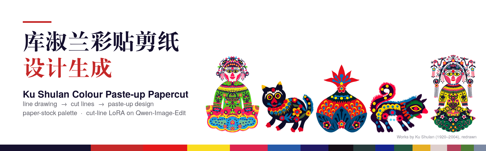
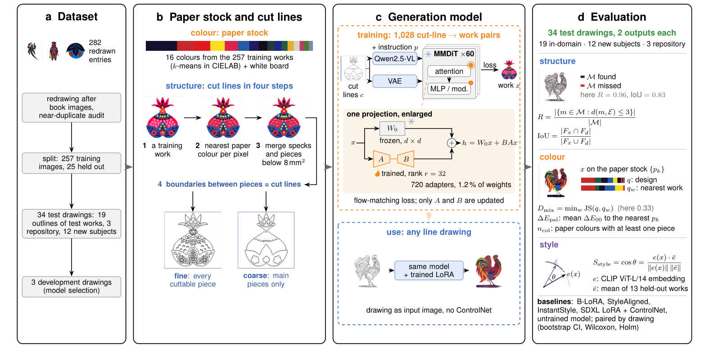
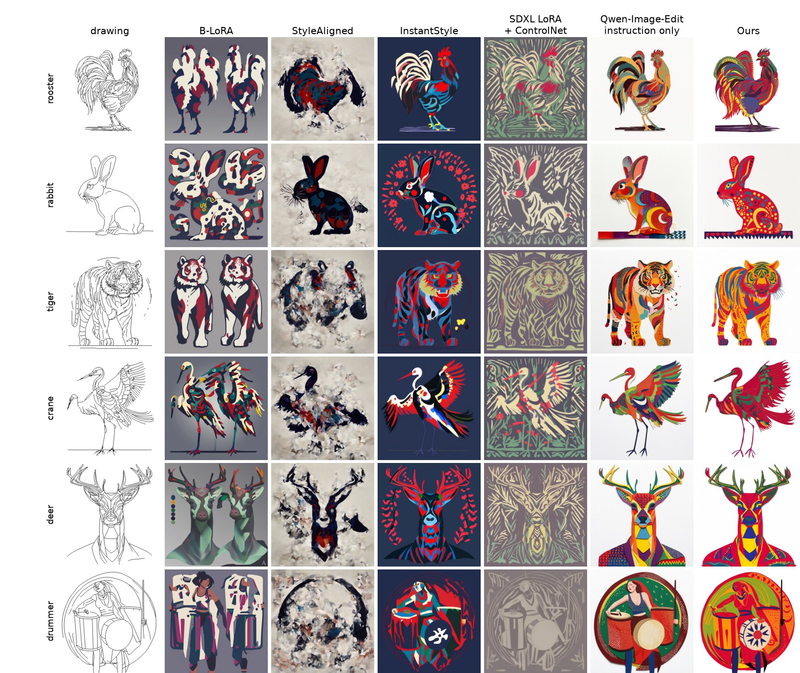

# Ku Shulan colour paste-up papercut design generation



[](https://github.com/lzwhehe/kushulan-papercut-blora/actions/workflows/ci.yml)
[](../LICENSE)
[](https://www.python.org/)
[](https://pytorch.org/)
[](https://huggingface.co/Qwen/Qwen-Image-Edit-2511)
[](#method-in-brief)
[](https://www.ihchina.cn/project_details/20139)
[](#)

[中文介绍](../README.md)

Ku Shulan (1920–2004) made colour paste-up papercuts, part of the Xunyi colour paste-up papercut listed as national intangible cultural heritage of China. She cut a few flat, saturated papers into pieces and pasted them onto white board. This project studies how an image generator can learn her two craft decisions: which papers to use, and how to divide a figure into pieces that can be cut and pasted by hand.

A paper is in preparation; a link will be added once it is published.

## Method in brief

[](assets/framework.png)

1. **Dataset.** Colour-calibrated redrawings of her works, grouped as figures, animals, plants, daily objects, window flowers and borders, and split into training, development and test sets.
2. **Paper stock and cut lines.** A paper-stock palette is estimated from the training works. Each work is mapped to its nearest papers and small specks are merged; the boundaries between pieces are the cut lines, at a fine and a coarse level.
3. **Generation model.** A LoRA on the image-editing model Qwen-Image-Edit is trained on pairs of cut lines and works. At use, a line drawing is given directly as the input image: no ControlNet and no per-drawing training.
4. **Evaluation.** Structure, colour and style are compared with other generation methods.

## Main results

34 test drawings (19 outlines of held-out works, 12 subjects she never cut, 3 repository drawings), two outputs each, drawing-level means:

| Method | Line recall ↑ | Silhouette IoU ↑ | CLIP style ↑ | Colour-mix distance ↓ | Palette ΔE ↓ | Paper colours | KID ↓ |
| --- | ---: | ---: | ---: | ---: | ---: | ---: | ---: |
| Reference redrawings | 0.95 | 0.85 | 0.852 | 0.01 | 6.4 | 6.1 | 0.07 |
| B-LoRA (earlier workflow of this repository) | 0.57 | 0.32 | 0.744 | 0.48 | 9.4 | 8.2 | 0.52 |
| StyleAligned + ControlNet | 0.88 | 0.32 | 0.762 | 0.51 | 9.3 | 10.4 | 0.95 |
| InstantStyle + ControlNet | 0.95 | 0.32 | 0.808 | 0.43 | 10.0 | 12.3 | 0.45 |
| SDXL LoRA + ControlNet | 0.88 | 0.32 | 0.781 | 0.50 | 17.2 | 5.6 | 0.45 |
| Qwen-Image-Edit, instruction only | 0.89 | 0.68 | 0.773 | 0.49 | 9.2 | 11.2 | 0.66 |
| **Ours (cut-line pairs)** | **0.97** | **0.87** | **0.848** | **0.41** | **6.9** | 7.9 | **0.11** |
| Ablation: Canny-edge pairs | 0.98 | 0.87 | 0.842 | 0.43 | 7.7 | 9.8 | 0.14 |

- Our model exceeded every baseline in line recall, silhouette IoU and CLIP style (paired tests, p < 0.001); its palette distance of 6.9 was the lowest of all generative methods, near the 6.4 of the references.
- The pre-registered comparison with the untrained model confirmed all four primary measures (Holm-adjusted p < 0.001).
- Trained on Canny edges instead, the same model reached the same structure and style but used 9.8 paper colours per design, against 7.9 with cut lines and 6.1 in the references (exploratory).

[](assets/results_new_subjects.jpg)

*Subjects she never cut: drawing and the output of each method (seed 0).*

## Repository layout

```text
papercraft/             all code: data preparation, palette, cut lines, training, sampling, evaluation, figures
papercraft/qwen/        editing model: pair preparation, LoRA training, sampling, protocol fixed before testing
papercraft/baselines/   baseline methods
results/cutcraft/       palette, data split, near-duplicate groups and per-image metric tables
Experiment/             earlier B-LoRA weights and checkpoints; cutcraft/ holds the SDXL cut-line style block
docs/                   records of earlier experiments
vendor/B-LoRA/          pinned official B-LoRA implementation
```

## Reproduction

Training and sampling ran on a 96 GB GPU (RTX PRO 6000) in bf16 at 1024 px; LoRA training uses DiffSynth-Studio @7539a33. The images of Ku Shulan's works are not public (see below), so the pipeline needs the data first.

```bash
cd papercraft
python build_data.py                                   # split, paper-stock palette, corpus statistics
python cutlines.py                                     # fine and coarse cut lines
python make_contents.py                                # test drawings
python qwen/prepare_edit_data.py --out ../outputs/qwen_pairs            # training pairs
bash qwen/train_qwen_lora.sh ../outputs/qwen_pairs ../outputs/qwen_work 3
python qwen/qwen_sample.py --lora <LoRA of the selected epoch> --out ../outputs/gen/qwen_q1
python evaluate.py --gen ../outputs/gen/qwen_q1        # structure, colour and style measures
python revision_metrics.py --embed qwen_q1
python stats.py                                        # paired statistics
```

The epoch is chosen on the development drawings by a rule fixed in advance: [papercraft/qwen/PROTOCOL.md](../papercraft/qwen/PROTOCOL.md).

## Data and licence

- The reference images are redrawings of Ku Shulan's works made after images in published books and articles. Her works remain under copyright, and the rights of her heirs and of the redrawers have not been cleared for publication. The images, the test outlines and all image material derived from them (cut-line maps and the like) are therefore **not publicly released**. They are available for non-commercial research on request, subject to the permission of the rights holders.
- The five works in the banner are redrawings of Ku Shulan's works, shown only to present the project and not covered by the repository licence; the full dataset is not released.
- The palette, data split, near-duplicate groups and per-image metric tables are in `results/cutcraft/`.
- Code and original documentation are under the [MIT License](../LICENSE); third-party code in `vendor/` keeps its own licence.

## Earlier phase: B-LoRA style–content separation

The repository started as a record of style–content separation with SDXL and B-LoRA. Its weights, checkpoints and records are kept:

- [Experiments](EXPERIMENTS.md) · [Results](RESULTS.md) · [Dataset notes](DATASET.md) · [Migration and verification](MIGRATION.md)
