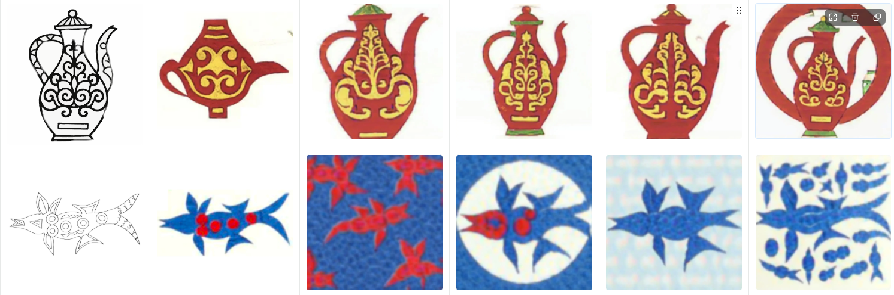
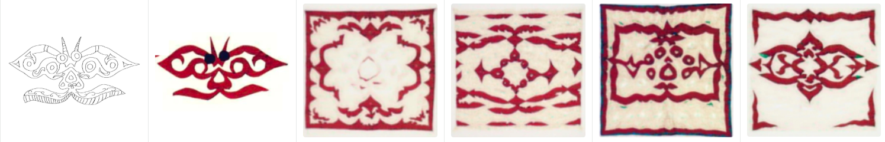
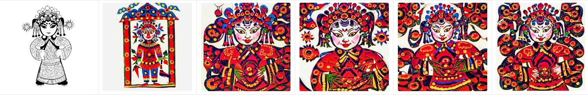

# 生成结果与对比记录

首页展示来源于 [《新结果与7.2测试结果对比 副本》](https://www.yuque.com/ariel-cgurv/br3z17/sba8ooeg1ir3fpaz)，该文档按“内容、风格、结果”组织图像，并保留“7.5结果”与“6.29结果”分组。源页面可能需要语雀登录；本仓库已保存用于展示的原始图片。

## 首页样例的选取

使用“7.5结果”分组的前三个图像行，分别是鱼、鸟和左右对称纹样。每行选择第一张结果，不改变内容图与风格图的对应关系。它们不是新增生成结果，也不代表所有样例的平均效果。

| 内容形态 | 风格参考形态 | 展示位置 |
| --- | --- | --- |
| 鱼形线稿 | 猫形剪纸 | 7.5 分组第 1 个图像行，首个结果 |
| 展翅鸟形线稿 | 长尾动物剪纸 | 7.5 分组第 2 个图像行，首个结果 |
| 左右对称纹样线稿 | 蜘蛛形剪纸 | 7.5 分组第 3 个图像行，首个结果 |

这三组可用于观察内容形态与参考风格的跨形态组合，也能看到输出中背景纹样扩展、细节重组等现象。仅凭选出的图片，不能计算结构保真度或证明优于其他模型。

## 文档中的补充对照

下列三张图是源文档已有的对照拼图，原样保存。每行前两列分别为内容图、风格图，后四列为生成结果。源图没有给每个结果列注明独立参数，因此不补写种子、步数、CFG 或模型版本。

**茶壶与鱼形元素**

**对称纹样**

**人物元素**

## 定性观察与对比实验

源文档提出了三个观察方向：风格参考的清晰程度可能影响效果；内容线稿清晰度值得控制；风格图颜色复杂度本身不足以解释最终质量。文档还提出固定内容图、交叉使用提示词来区分图像与提示词影响。这些是实验记录中的观察和后续验证思路，尚不是经过统计检验的结论。

另参考用户提供的 17 页 PDF《对比实验 副本 · 语雀》，对应 [《对比实验 副本》](https://www.yuque.com/ariel-cgurv/br3z17/nnegag2lcp019x2w)，它与首页图片来源是两份不同文档：

| 实验方向 | PDF 位置 | 记录内容 |
| --- | --- | --- |
| 简单与复杂提示词 | 第 1–7 页 | 花卉、花瓶的内容提示词、风格提示词、推理提示词及结果 |
| 轮廓线粗细 | 第 7–17 页 | 鱼、昆虫、鸟等内容线稿、风格参考与结果 |

这些资料补充了对比样例和提示词文本，但尚未提供完整的固定种子、训练配置、逐次运行日志及评分表，因而不在 README 中宣称量化提升或严格复现。

## 来源与完整性

`metadata/result_gallery_sources.json` 记录 12 张展示资产的来源 URL、用途、字节数与 SHA-256，以及所参考 PDF 的文件名、页数和 SHA-256。所有图片均从源页面导出，文件内容保持不变；网页只调整显示尺寸。

这批图片在原始项目迁移之后补充，不计入 `metadata/source_manifest.jsonl` 中最初的 3,443 个源文件。原始 `Experiment/test-round1/res/` 的 8 张图片继续保留。网页实验图与本地导出权重尚没有逐次运行的映射，不能默认认为两者属于同一次实验。

展示资产不自动适用代码的 MIT 许可，许可范围与其他研究资料一致，见 [数据说明](DATASET.md)。
